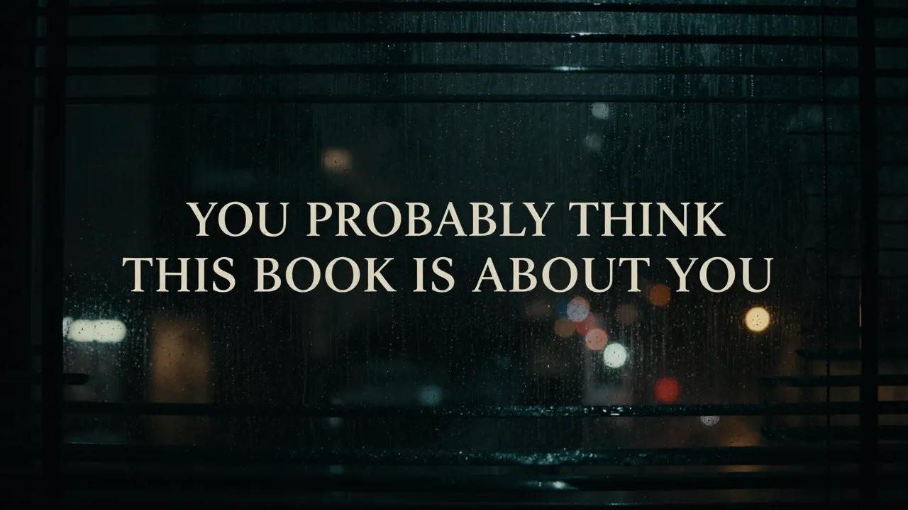

# Book Launch Playbook

> *The open-source guide to launching a book with zero budget, a phone, and the truth.*

---

## The Story

A concrete dispatch operator in Hazel Green, Alabama recorded voice memos on his drive home from work. An AI shaped them into noir prose. A Raspberry Pi 5 in a closet ran the whole stack. The result was a book — **"You Probably Think This Book Is About You"** — 22 noir vignettes about ego, identity, and the people you drive past every day.

Then came the hard part: getting anyone to read it.

This repo is the playbook that came out of that process. Every template was written and used. Every tactic was tested from a phone between dispatch calls. Every result is documented honestly — including the parts that didn't work.

**This playbook is for anyone who made something real and needs the world to find it.**

---

## What's Inside

### Campaign Templates
Pre-written, copy-paste-ready social media posts organized by platform and angle. Open on your phone, copy, paste, post. Ten platform-specific posts covering the announcement, the AI angle, the technical angle, the faith angle, the sobriety angle, the local angle, and quick-share formats for when you have thirty seconds between tasks.

### Posting Schedule
A two-week launch calendar that tells you what to post, where, and when. Plus an evergreen rotation for the months after launch. Plus a daily checklist you can run from your phone in under five minutes.

### Platform Guides
What works on Facebook doesn't work on Reddit. What works on Reddit gets you muted on Discord. What works on Discord doesn't exist on LinkedIn. Each platform gets its own playbook.

### The AI Conversation
The hardest marketing problem for AI-assisted creators: how do you talk about the collaboration without apologizing for it? This guide has the framework, the language, and the reply templates for every version of "but did AI write it?"

### Reddit Strategy
Subreddit targets, community rules, post formats, and the one rule that matters: contribute first, promote second. Reddit will eat you alive if you lead with a link.

### Case Study
The real timeline. The real numbers. The real mistakes. Updated as they come in. No vanity metrics. No "we're thrilled to announce." Just the truth.

---

## The Philosophy

Marketing a book is not different from writing a book. Both require the same thing:

**Tell the truth. Tell it in your voice. Tell it to the right person.**

The person who will love your book is already out there. They're scrolling past a thousand things that aren't for them. Your job is not to convince everyone. Your job is to be loud enough — and honest enough — for the right person to stop scrolling.

This playbook is not about going viral. It's about finding your reader.

---

## The Case Study

**The Book:** *You Probably Think This Book Is About You*
**Author:** Shane Brazelton
**Co-built with:** Claude (Anthropic)
**Hardware:** Raspberry Pi 5, 16GB RAM, RAID 1 NVMe, closet in Alabama
**Published:** Amazon KDP
**Marketing budget:** $0
**Time spent marketing per day:** 5-10 minutes from a phone

**Amazon:** [Buy the book](https://www.amazon.com/Probably-Think-This-Book-About/dp/B0GT25R5FD)
**Writing Process:** [How it was made](https://github.com/thebardchat/noir-detective-writing-process)

---

## How to Use This Playbook for YOUR Book

1. **Fork this repo** or clone it
2. Replace the case study details with your own book
3. Adapt the templates — the structure works for any genre, any platform
4. Follow the schedule or build your own from the templates
5. Track your numbers honestly in the case study folder
6. Share what you learn — open a PR if you find something that works

The templates are written for a noir detective book, but the bones work for anything. A romance novel. A poetry collection. A technical manual. A cookbook. The angles change. The honesty doesn't.

---

## Everything Here Follows the Constitution

> Every repo in the ShaneBrain ecosystem operates under one governing document.

**[Read the ShaneTheBrain Constitution](https://github.com/thebardchat/constitution/blob/main/CONSTITUTION.md)**

Nine pillars. One covenant. No exceptions.

---

## Built With

<table>
  <tr>
    <td align="center" width="200">
      <b>Claude by Anthropic</b> 
      AI partner and co-builder.  
      <a href="https://claude.ai"><code>claude.ai</code></a>
    </td>
    <td align="center" width="200">
      <b>Raspberry Pi 5</b> 
      Local AI compute node.  
      <a href="https://www.raspberrypi.com"><code>raspberrypi.com</code></a>
    </td>
    <td align="center" width="200">
      <b>Pironman 5-MAX</b> 
      NVMe RAID 1 chassis by Sunfounder.  
      <a href="https://www.sunfounder.com"><code>sunfounder.com</code></a>
    </td>
  </tr>
</table>

---

## Support This Work

If what I'm building matters to you — local AI for real people, tools for the left-behind — here's how to help:

- **[Sponsor me on GitHub](https://github.com/sponsors/thebardchat)**
- **[Buy the book](https://www.amazon.com/Probably-Think-This-Book-About/dp/B0GT25R5FD)** — *You Probably Think This Book Is About You*
- **Star the repos** — visibility matters for projects like this

Built by **Shane Brazelton** · Co-built with **Claude** (Anthropic) · Hazel Green, Alabama

---

*Part of the [ShaneBrain Ecosystem](https://github.com/thebardchat) · Built under the [Constitution](https://github.com/thebardchat/constitution)*

---

### ⚡ Pulsar Sentinel — Quantum Security for the Rest of Us

**800 million Windows computers just lost security updates.**
Pulsar Sentinel wraps them in ML-KEM post-quantum encryption, immutable blockchain audit trails, and automatic digital inheritance — no lawyers, no cloud dependency, no corporate kill switch.

**[→ Get Protected at sentinel.shanebrain.cloud](https://sentinel.shanebrain.cloud)**

*Built by Shane Brazelton + Claude (Anthropic) · Hazel Green, Alabama*

---
